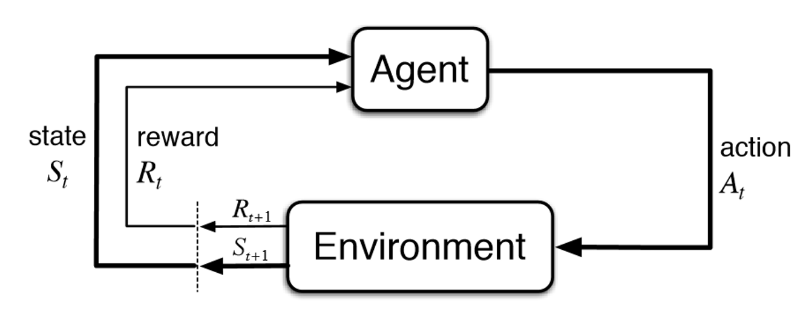

# AIBot-Proxy

## Architecture 


the proxy server has 2 purposes:

+ serving as a http server for sagemaker endpoint
+ playing as wss/tcp client for custom protocol adaptation

Moreover, it final implementation depends on the designer's categorization of the Dedicated server APIs, which usually refers to 4 domains: **Init** **State** **Reset** and **Action** , to complete the Reinforcement Learning Architecture



## Protos

Some dedicated server only serve protos, hence I designed a translation from proto(python) to json format.

### brief

proto is a faster serilization/deserilization method comparing to json/txt format. To use it, a proto extension for schema is needed, and a proto compilier is used to translate the binary message to the corresponding language class, back and forth, which provides setter/getter funcitons


## How to start

### a testing websocket server (serve json response) port: 8765

python3 wsServer.py [--host localhost --port 8765]

### a testing tcp server (serve proto response) port : 8000

python3 tcpSrver.py [--host localhost --port 8765]

### proxysrever (wssclient + httpserver) serving port 5000

python3 proxy.py --host 0.0.0.0 --port 5000 [--mode wss]

### proxysrever (tcpclient + httpserver) serving port 5000

python3 proxy.py --host 0.0.0.0 --port 5000 [--mode tcp]

### curl following apis

* http://0.0.0.0:5000/
* http://0.0.0.0:5000/init
* http://0.0.0.0:5000/state
* http://0.0.0.0:5000/reset
* http://0.0.0.0:5000/action

**state**: you can pass a json {"code": 10117} to get targeting queue msg, if code = 0, it will return last successful state msg

## how to config

```
[config]
# ws server location
remoteUri = ws://localhost:8765
# tcp server location
remoteTcp = localhost:8000
# flask server key
secretKey = benxiwan
# flask server listen to 
listen = 0.0.0.0
port = 5000
# type of wss client payload: 0: str 1: bytes
binary = 0
# type of tcp client payload: 0: bytes 1: proto
proto = 0


[route]
init = []
action = []
reset = []
state = [1017,4096,4993]
```


